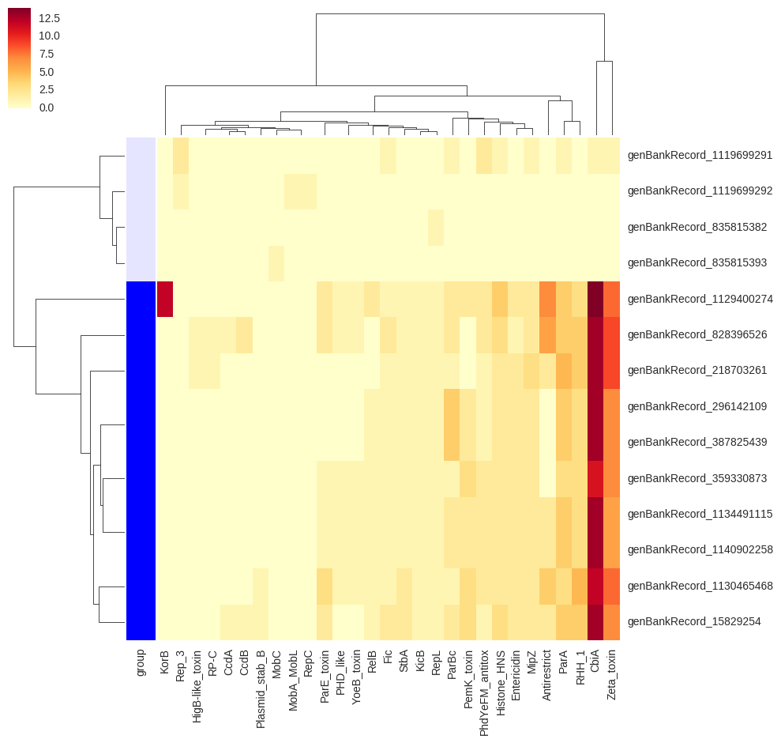
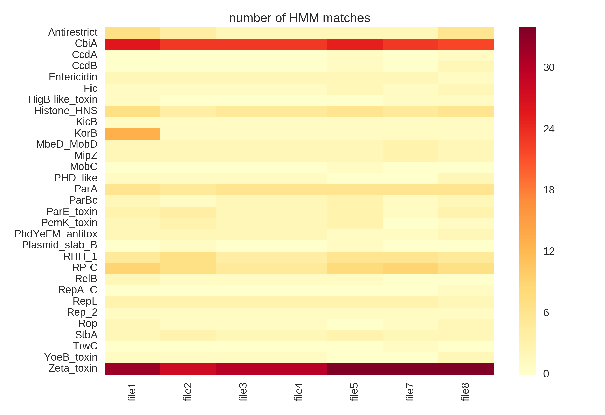
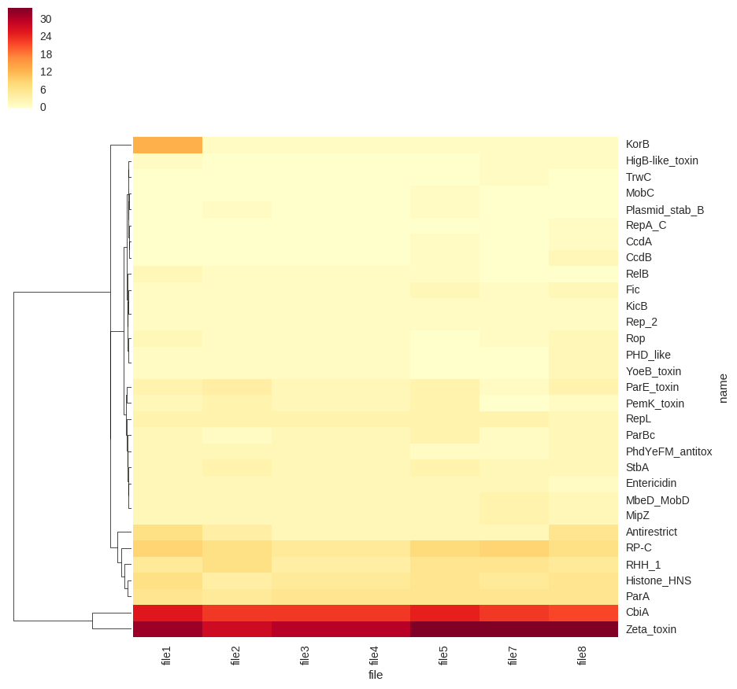

Just a simple tool to check if some HMM profiles are present in a bunch of fasta files. You can put input fasta files into subfolders to visualize groups in the heatmap.

# usuage

```
usage: hmmvis [-h] [--hmm HMM] [--fasta_dir FASTA] [--output_dir OUT]
              [--use_query] [--colorful] [--normalize] [--keep_order]
              [--version]

optional arguments:
  -h, --help         show this help message and exit
  --hmm HMM          path to hmm file
  --fasta_dir FASTA  path to folder where .fasta files are located (fasta
                     files can be grouped within subfolder)
  --output_dir OUT   path to output folder
  --use_query        use query id insead of accession
  --colorful         use colors for heatmap
  --normalize        normalize cluster map
  --keep_order       do not cluster rows if groups are present
  --version          show program's version number and exit
```


# output
## automatic grouping of input fasta files

`hmmvis/hmmvis --hmm example/example.hmm --fasta_dir example/faa_grouped --use_query --colorful`



## without grouping

`hmmvis/hmmvis --hmm example/example.hmm --fasta_dir example/faa --use_query --colorful`





# installation

install dependencies
```
sudo apt-get install python python-setuptools libblas-dev liblapack-dev gfortran libpython2.7-dev python-numpy
wget https://bootstrap.pypa.io/get-pip.py
python get-pip.py
pip install numpy # see bug https://github.com/scikit-learn/scikit-learn/issues/4164
```

install hmmvis
```
git clone https://github.com/philippmuench/hmmvis.git
cd hmmvis
python setup.py install
```

you also need dependencies: 
- `prodigal`
- `hmmer`

# licence
GNU General Public License, version 3 (GPL-3.0)

# cite
this script is part of the PlasmidMiner toolkit. If you use this script please cite:

```
Muench et al., A method for the in silico detection of plasmid fragments in environmental samples
```
